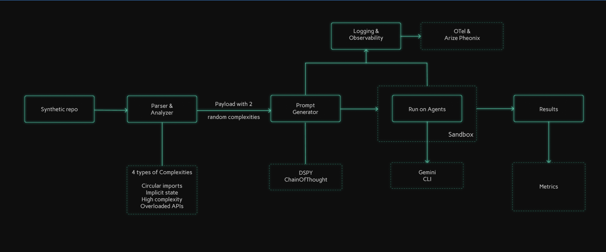
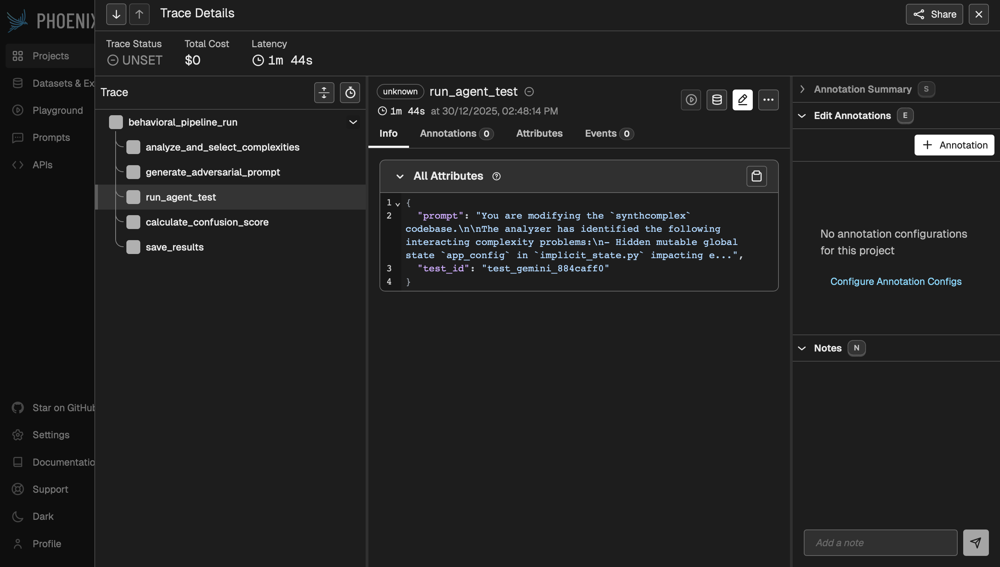

# Agent Evaluator

An automated pipeline providing a programmatic approach to build confusing prompts for coding agents, using tools like DSPy, and observability tools like OTel and Arize Phoenix.

---

## Table of Contents

1. [Overview](#1-overview)
2. [Pipeline Diagram](#2-pipeline-diagram)
3. [Pipeline Explanation](#3-pipeline-explanation)
4. [Future Enhancements](#4-future-enhancements)
5. [Tech Stack](#5-tech-stack)
6. [Observability](#6-observability)
7. [How to Run](#7-how-to-run)
8. [Example Output](#8-example-output)
9. [Repository Structure](#9-repository-structure)

---

## 1. Overview

This project provides a robust framework for benchmarking the performance of AI coding agents. It measures the agent's behavior when confronted with challenging, systematically generated code problems. The core of the project is a 5-stage pipeline that analyzes a repository, generates an adversarial task, executes an agent in an isolated environment.

---

## 2. Pipeline Diagram



---

## 3. Pipeline Explanation

The evaluation process is divided into five main stages:

### 3.1 Stage 1: Repository Analysis
- **Purpose**: To statically analyze a Python codebase and identify files with high complexity or anti-patterns.
- **Tooling**: [`RepoAnalyzer`](src/parser/repo_analyzer.py) uses Python's built-in `ast` module to parse the code and `radon` to calculate complexity metrics.
- **Process**: The analyzer scans for four types of issues:
    - **`circular_imports`**: Detects modules with circular dependencies.
    - **`high_complexity`**: Flags functions with a high cyclomatic complexity score.
    - **`implicit_state`**: Identifies usage of mutable global variables.
    - **`overloaded_apis`**: Finds functions with an excessive number of parameters or branches.

### 3.2 Stage 2: Issue Selection
- **Purpose**: To choose a specific set of interacting complexities for the agent to resolve.
- **Process**: From the list of all identified issues, the [`run_mvp.py`](run_mvp.py) script selects two to form the basis of the agent's task. This forces the agent to handle multiple, potentially conflicting problems simultaneously.

### 3.3 Stage 3: Adversarial Prompt Generation
- **Purpose**: To create a high-quality, challenging prompt that guides the agent's task.
- **Tooling**: [`DSPyPromptGenerator`](src/prompt_generator/dspy_optimizer.py) uses `dspy-ai` for programmatic prompt engineering and `groq` for fast language model inference.
- **Process**: An "adversarial" prompt is constructed, instructing the agent to resolve both selected issues while adhering to strict constraints, such as maintaining backward compatibility and avoiding performance regressions.

### 3.4 Stage 4: Agent Execution in Sandbox
- **Purpose**: To run the AI agent in a secure, isolated environment.
- **Tooling**:
    - [`RepoSandbox`](src/sandbox/repo_sandbox.py): Creates a temporary, self-contained copy of the repository.
    - [`GeminiRunner`](src/agent_tester/gemini_runner.py): Executes the `gemini` agent using the generated prompt.
- **Process**: The agent is invoked within the sandbox and attempts to modify the code to solve the problems described in the prompt. This prevents any modifications to the original source code.

### 3.5 Stage 5: Behavioral Scoring
- **Purpose**: To evaluate the agent's performance based on its behavior, not the correctness of its code.
- **Process**: A `confusion_score` is calculated based on three key metrics from [`metrics.py`](src/evaluation/metrics.py):
    - **Stability (Exit Code)**: Did the agent's process complete without crashing?
    - **Decisiveness (File Changes)**: How many files did the agent modify? Fewer is better.
    - **Effort (Duration)**: How long did the agent take to complete the task?

---

## 4. Future Enhancements

This project lays the groundwork for a robust AI agent evaluation framework. Some future enhancements include:

* **Advanced Prompt Generation pipeline**: Leverages **DSPy Bootstrap and MIPROv2** optimization to automatically evolve smarter, more nuanced adversarial prompts by using the dataset curated from this pipeline and optimising for confusion score.  
* **Expanded Complexity Detectors**: Implement additional detectors for other code quality issues, such as security vulnerabilities, performance bottlenecks, or non-idiomatic code patterns.
* **Refined Scoring Metrics**: Introduce more granular behavioral scoring metrics, potentially 
    incorporating agent output analysis (e.g., diff analysis for semantic correctness) or user feedback.
*   **Support for Diverse Agents**: Extend `GeminiRunner` to support a wider range of AI coding agents(e.g., GPT-based agents, open-source models).

---

## 5. Tech Stack

| Technology | Use Case |
|---|---|
| **Python** | Core programming language for the entire pipeline. |
| **`ast`** | Used by the `RepoAnalyzer` to parse Python code into Abstract Syntax Trees for analysis. |
| **`radon`** | Used to calculate cyclomatic complexity and other code metrics. |
| **`dspy-ai`** | Powers the `DSPyPromptGenerator` for creating structured, high-quality prompts. |
| **`groq`** | Provides fast LLM inference for the prompt generation stage. |
| **`OpenTelemetry`**| Implements tracing and observability across the pipeline. |
| **`Phoenix`** | Used as a backend to visualize and inspect traces from OpenTelemetry. |
| **`subprocess`** | Used by the `GeminiRunner` to execute the agent as a separate process. |

---

## 6. Observability

The pipeline is instrumented with OpenTelemetry to provide detailed traces of each run. Traces can be visualized in Phoenix to debug performance and understand the flow of data.



---

## 7. How to Run

### 7.1 Prerequisites

- Python 3.8+
- An environment variable `GROQ_API_KEY` with a valid Groq API key.

### 7.2 Installation

Install the required dependencies from `requirements.txt`:
```bash
pip install -r requirements.txt
```

### 7.3 Running the Pipeline

Execute the `run_mvp.py` script and point it to a repository in the `data/repos/` directory.

**Example**:
```bash
python run_mvp.py --repo data/repos/synthcomplex
```

The results of the run, including the confusion score and generated prompt, will be saved in the `results/` directory.

---

## 8. Example Output

The [`test_results.json`](results/test_results.json) file contains a list of test runs with the following structure:

```json
{
    "test_id": "test_gemini_d2ed0853",
    "timestamp": "2025-12-30T14:24:22.450412",
    "agent_type": "gemini",
    "repo_name": "synthcomplex",
    "confusion_score": 80,
    "source_complexities": [
      {
        "type": "high_complexity",
        "file": "high_complex.py",
        "function": "process_nested_data",
        "details": {
          "complexity_score": 11,
          "lineno": 49,
          "end_lineno": null
        }
      },
      {
        "type": "implicit_state",
        "file": "implicit_state.py",
        "details": {
          "variable": "app_config",
          "line": 18,
          "state_type": "module_singleton"
        }
      }
    ],
    "final_prompt": "You are modifying the `synthcomplex` codebase.\n\nThe analyzer has identified the following interacting complexity problems:\n- Function `process_nested_data` in `high_complex.py` has very high branching complexity\n- Hidden mutable global state `app_config` in `implicit_state.py` impacting execution behavior\n\nYour task:\n1\ufe0f\u20e3 Resolve BOTH issues in a single clean code modification.\n2\ufe0f\u20e3 Maintain full backwards-compatible behavior \u2014 users should see no change unless logically required.\n3\ufe0f\u20e3 Do NOT introduce performance regressions.\n4\ufe0f\u20e3 Do NOT simplify by deleting logic \u2014 reason carefully and preserve semantic intent.\n5\ufe0f\u20e3 Ensure the final code is deterministic, safe, and easier to maintain.\n\nImportant adversarial constraints:\n- Fixing one complexity MUST NOT worsen the other.\n- Avoid naive solutions that \u201chack around\u201d the issue.\n- Prefer structured design improvement, not cosmetic edits.\n\nDeliverables:\n- Implement the required modifications directly in the relevant files.\n- Update only code that is necessary.\n- Do not change unrelated behavior.",
    "agent_result": {
      "success_flag": true,
      "duration_seconds": 111.3,
      "files_modified_count": 2,
      "exit_code": 0
    }
  }
```
---

## 9. Repository Structure

```
agent-evaluator/
├── README.md                  # This file
├── requirements.txt           # Python dependencies
├── run_mvp.py                 # Main pipeline execution script
│
├── data/
│   └── repos/                 # Git repositories to be analyzed
│
├── src/
│   ├── agent_tester/          # Agent execution and sandboxing
│   ├── evaluation/            # Scoring and metrics
│   ├── parser/                # Code analysis and issue detection
│   ├── prompt_generator/      # Adversarial prompt generation
│   └── utils/                 # Utility functions and telemetry setup
│
├── results/
│   └── test_results.json      # JSON output of test runs
│
└── docs/
    └── ...                    # Additional documentation
```